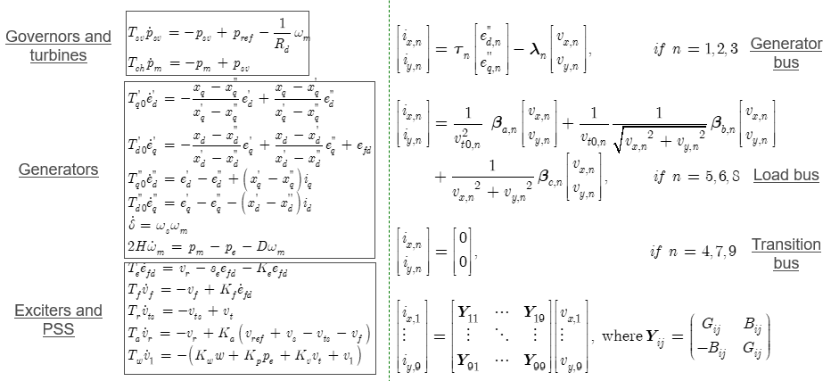

In [DynamicSimulationProcedure_General](DynamicSimulationProcedure_General.md), I have covered the procedures, challenges, considerations regarding flexibility, and the Differential-Algebraic Equation (DAE) model of a simple 3-machine 9-bus power system solved using numerical methods. This post will delve deeper into the general procedure of employing a semi-analytical solution (SAS) method based on differential transformation (DT) to tackle the DAE model. Additionally, it will address the supplementary challenges introduced by the SAS approach and provide an illustrative example of using the DT method to solve the DAE model for the 3-machine 9-bus system.

# Basics of DT method

Additional transformation rules for more complicated operations? 
+ will be added later

# Procedure of DT method for solving DAE model
  

# Example
Consider the DAE model for the 3-machine 9-bus system.
  

The DT method will apply term-by-term transformation rules to convert the original DAEs into difference equations. This transformation step is performed offline.

  

The equation above is further restructured into the following linear form. (Note: There is potential to directly transform the DAE into this form to streamline the process, and we will investigate its implementation feasibility.)

  

Following that, we can recursively solve for the coefficients and derive the Taylor series solution. 

You can find the algorithms for solving the coefficients illustrated in the figure below.

# Challenges associated with the SAS methods (including DT)

Despite offering significantly higher performance, SAS methods face their greatest challenge in demanding explicit, clear expressions to facilitate **holistic** and **term-by-term** symbolic operations.

When the model remains fixed, this requirement is manageable. However, in the context of power system dynamic simulation programs, adaptability to diverse models and model expression changes is essential.

What does this mean?

Imagine you've developed an initial power system dynamic simulation program that employs both numerical methods and SAS methods. Now, a utility company provides you with their system model, which includes certain models not previously considered in your code. What should you do? (similiary for other cases that involve model changes, for example, contingencies)

+ For numerical approaches, simply adding the new model to the DAE model file suffices. No changes to the numerical solver are necessary.

+ For SAS methods, in addition to incorporating the new model in the DAE model file, you also need to adjust the SAS expressions accordingly. Sometimes, making adjustments can be straightforward. However, in certain cases, these adjustments may involve multiple changes, because the SAS is derived in a **holistic** manner for the entire explicit system model.  This introduces an additional flexibility requirement, specifically, the need for a well-structured, modular, and extensible SAS framework (<u>The major focus of our Julia based dynamic simulation tool</u>).

Additional challenges, which also present potential opportunities for enhancing SAS performance, include the current naive implementation of SAS methods. This encompasses aspects such as the recursive calculation of Taylor series coefficients, the formulation and modification of matrices, and matrix operations like multiplication and decomposition. By adopting advanced software engineering practices, selecting appropriate programming languages and coding practices, leveraging suitable libraries and tools, substantial improvements in performance can be achieved.

Additionally, it's worth noting that numerical integration methods have been implemented and refined over several decades in various fields. They have matured, benefitting from ample experience in becoming well-structured, modular, and extensible.

In contrast, SAS methods are relatively new and have not yet been widely adopted as a development product for solving practical engineering systems. While there are some implementations in the field of physics, they often do not encompass the practical complexities found in engineering domains like power systems. These implementations typically fall into the category I previously mentioned, where creating an initial power system dynamic simulation program is a manageable task and does not address the genuine challenge of adaptability to diverse power systems, various model types, a range of operating conditions, different contingencies and events, and multiple data sources.

As the first work that introduces SAS technology into the power engineering field, our previous emphasis was on validating the feasibility and advantages of the SAS method in a wide range of power system simulation challenges. The Matlab version of our tool, PowerSAS.m, still remains within the realm of research code and grapples with limitations in its flexibility to effectively handle real-world power system models.

As we move forward, our central focus will be on a groundbreaking endeavor: overcoming the implementation challenges and crafting a well-structured, modular, and extensible SAS framework, implemented in Julia. With an improved implementation, we anticipate even more significant speedup enhancements, allowing us to better realize the potential of the SAS approach. Our overarching vision is to harness this innovative development to directly support practical use cases in the realm of industrial power system models.

