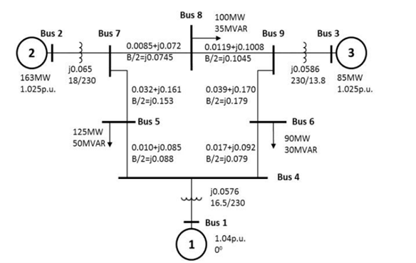
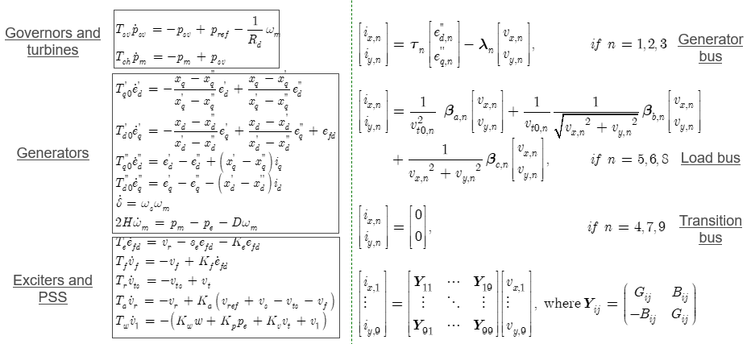
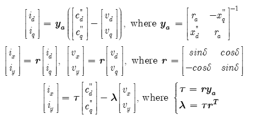
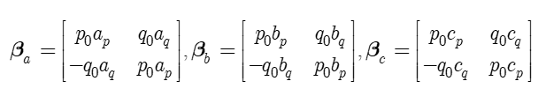

# How to Develop a Power System Dynamic Simulation Program

## Introduction
Power system dynamic simulation is a crucial tool for understanding and analyzing the behavior of electrical grids under various operating conditions and disturbances. This tutorial aims to guide developers through the process of creating a power system dynamic simulation program. It provides a step-by-step procedure, valuable tips, and insights into potential challenges that developers may encounter during the development process.

**Target Audience**: 
+ Researchers and developers interested in power system dynamic problems
+ Engineers who seek to understand the underlying principles of commercial software (such as PSS/E, DSA tools, PowerWorld) 
+ Researcher who wish to engage in hands-on dynamic simulation program development.  
+ Educators seeking teaching materials and experient materials for "*Power System Analysis*" courses at both undergraduate and graduate levels.

## Problem Statement
To facilitate an easier start, let's initially concentrate on simulating transmission system phasor models. Handling distribution systems or Electromagnetic Transient (EMT) simulations introduces additional complexities, and we will address them in a later phase.

Within phasor domain simulations, there exist two primary model types: the full Differential-Algebraic Equation (DAE) model and a simplified Ordinary Differential Equation (ODE) model, assuming constant impedance load conditions. For this tutorial, our focus will be on the DAE model.

In essence, the objective of dynamic simulation entails solving the initial value problem defined by a set of nonlinear DAEs, as illustrated in Equation (1), where $x$ is a vector of state variables, $y$ is a vector of algebraic variables, $f$ is a vector of differential equations, and $g$ is a vector of algebraic equations, $x_0$ and $y_0$ are the intial values of state variables and algebraic variables. 

$$
\begin{cases}
  \begin{aligned}
  \frac{dx}{dt} = f(x,y,0) \\
  0     = g(x,y,0)
  \end{aligned}
\end{cases}
$$
$$
\begin{cases}
  \begin{aligned}
  x(0) = x_0 \\
  y(0) = y_0
  \end{aligned}
\end{cases}
$$

It is also common to express the DAE model in the following form, with a particular focus on bus voltage as the algebraic variable. Other algebraic variables are treated as intermediate variables without explicit notation. Here $v$ represents bus voltage, $i$ denotes the current injection from all buses, and $Y_{bus}$ represents the network admittance matrix.

$$
\begin{cases}
  \begin{aligned}
  \frac{dx}{dt} = f(x,v,0) \\
   i(x,v)     =  Y_{bus}v
  \end{aligned}
\end{cases}
$$
$$
\begin{cases}
  \begin{aligned}
  x(0) = x_0 \\
  v(0) = v_0
  \end{aligned}
\end{cases}
$$

To this end, the dynamic simulation program development will deal with following key questions:

1. How to formulate the DAE Model

2. How to obtain the parameters in the DAE model

3. How to obtain the intial value in the DAE model

4. How to solve the DAE model

Looks simple, right? Indeed, creating an initial power system dynamic simulation program is a manageable task. (I will show you an example on a 3-machine 9-bus power system soon) 

However, the REAL challenge lies in its adaptability to diverse power systems, various model types, a range of operating conditions, different contingencies and events, and multiple data sources. Furthermore, these components are interconnected. For instance, if the DAE model is modified, it necessitates corresponding adjustments in parameters and initial values. (It's worth noting that solvers typically remain unchanged for conventional numerical methods. However, this is not the case for the SAS method, which we will discuss separately.)

Therefore, developers should anticipate potential use cases from the outset to ensure early consideration of flexibility in code development.To plan for flexibility, developers should consider carefully selecting the appropriate programming language, designing a software architecture that is modular, extensible, and well-structured, and creating adaptable data structures, among other crucial considerations.

Here's a brief summary of the key considerations for flexibility in power system simulation:

1. In DAE Modeling:  
   + Variability in Dynamic Components: Power systems consist of multiple dynamic components like generators, motors, loads, governors, exciters, and controllers. Each of these components can have numerous models with varying variables and variable counts (e.g., synchronous generators with GENCLS, GENROU models).   
   + Component Presence or Absence: Some system components may be present in one scenario but absent in another. For instance, generators may be equipped with exciters and controllers in some cases but not in others.   
   + Contingencies and Events: Power systems can experience various contingencies and events, such as line additions/removals, bus modifications, and generator changes. These events require reconfiguring DAE models, parameters, and initial values.

2. In Initial Value Calculation:   
   + Different component models necessitate distinct initialization procedures. When a model is altered, the initialization process must also be adjusted accordingly.

3. In Parameter Acquisition:   
   + Certain parameters in the DAE model, such as those related to the network admittance matrix, cannot be derived from original data files as a one-time process. These parameters require ongoing calculations and updates throughout the simulation. The network admittance matrix, in particular, must be continually recalculated to reflect any changes that occur within the power system during the simulation, such as modifications to the network structure (e.g., additions or removals of lines, buses, or generators). 

These considerations underscore the need for a highly adaptable and modular approach to power system simulation, capable of accommodating a wide range of scenarios and changes within the system.

# Toy Example   

Let's consider a simple scenario, i.e., creating an initial power system dynamic simulation program, without worring about the challenges of adaptability to diverse power systems, various model types, a range of operating conditions, different contingencies and events, and multiple data sources, etc.

Test system: 
+ a 3-machine 9-bus power system.  

Model: 
+ assume all generators have the same model
+ assume 6nd order GENROU model, with governors, turbines, exciters and stablizers
+ assume a static ZIP load model, without motors and without dynamics

Contingency: 
+ Do not consider contingency. We can directly provide a disturbed initial values for simulation  

### Model Structure 
Let's first write down the full DAE model, which includes three major components.  
1. Differential equations of dynamic components (here, generators and controllers)
2. Current injection equations from each bus (generator buses, load buses, and transition buses)
3. Network balance equation  

  

I've structured the equations in a manner that explicitly delineates the current injection equations. Notably, the current injection equation, denoted as $i(x,v)$, entails a rather intricate expression, for both generators and loads. To facilitate understanding, I've introduced some notations. For a comprehensive understanding of how these notations relate to the original model parameters, please refer to the image below:  

Notations in generator bus current injections:  

Notations in load bus current injections:  

Traditional textbooks typically do not employ this organization method because it is unnecessary for traditional numerical approaches. They often present multiple equations sequentially without explicitly illustrating the relationships between current injection, voltage, and state variables. I've chosen this explicit and lucid approach because it's a necessity for the Semi-Analytical Solution (SAS) method, which relies on a clear expression and performs **term-by-term** symbolic operations. 

If you're interested in delving deeper into how I restructured the original power system model in this fashion, I'll provide more insights in a forthcoming post.

### Detailed Model Description:
A comprehensive description of the model will be added later.

### Parameter Acquisition in the DAE Model:
The methodology for obtaining parameters within the DAE will be added later.

### State Variable Initialization:
Details on how to initialize the state variables will be added later.

### Numerical Methods for Solving the DAE Model:
Numerical methods such as Modified Euler, Runge-Kutta, Trapezoidal, and Newton-Raphson, explaining how they can be applied to solve the DAE model in both a partitioned and simultaneous manner, will be added later. 

### Sample Code
Sample code will be added later.

